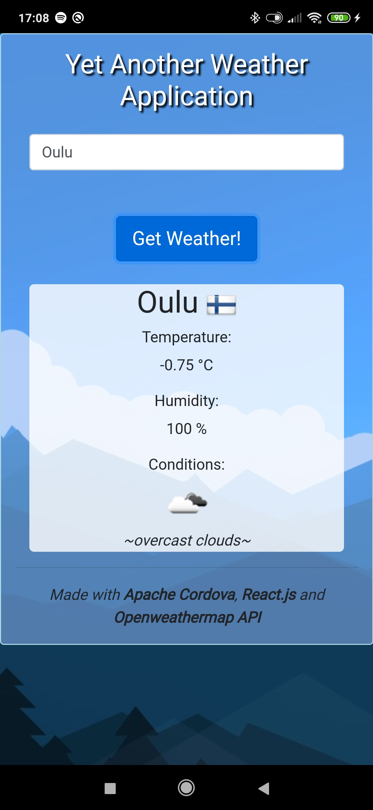

# React-Cordova-WeatherApp
This simple Openweathermap API based application was developed for school course.
<br>



### Pre-requisities
```
node
npm
cordova cli
android/ios device
```

### Install the app
```
npm install
cordova add platform <ios/android>
```
### Run the app
```
cordova run <ios/android>
```

### Built with
- React.js
- Apache Cordova
- Openweathermap API